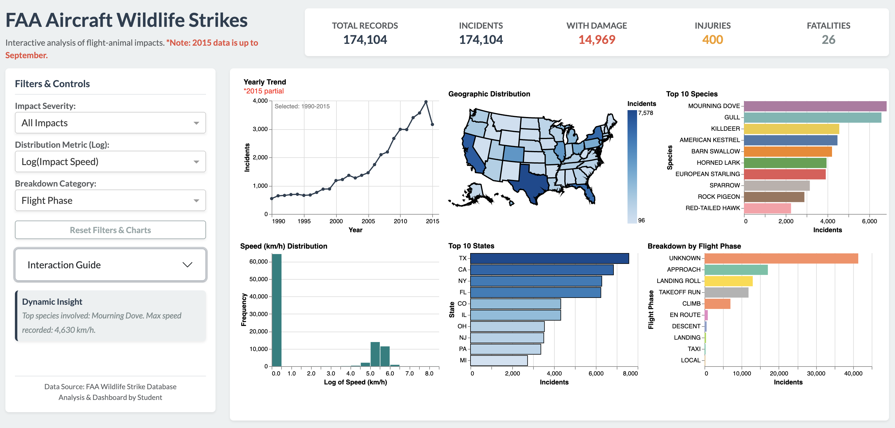

# FAA Aircraft Wildlife Strikes Dashboard (1990–2015)
*Interactive analysis of flight-animal impacts and their severities.*

### 🚀 Live Dashboard
**Access the interactive application here:** [https://flight-animal-impacts.onrender.com/](https://flight-animal-impacts.onrender.com/)  
*(Note: As this is hosted on a free cloud tier, please allow up to 60 seconds for the dashboard to "wake up" and load the dataset upon your first visit).*

<p align="center">
  
</p>

## Project Overview
This project builds a single-page interactive dashboard using the **FAA Aircraft Wildlife Strikes dataset (1990–2015)** to help users identify which bird species and conditions are associated with the most frequent and severe wildlife strike outcomes.

Users begin by selecting an **Impact Severity** (e.g., *All Impacts*, *Damage*, *Injuries*, or *Death*), then refine the view using dynamic dropdowns to change the distribution metric (Speed vs. Height) and the categorical breakdown (Flight Phase, Aircraft Type, or Month). The dashboard supports deep exploratory analysis through **six linked, coordinated visualizations** that allow users to cross-filter by brushing over years, clicking specific species, or hovering over the geographic map.

## Problem Statement
Wildlife strikes can cause major operational disruptions and, in rare cases, serious consequences such as aircraft damage, injury, or death. Identifying which species, locations, and flight conditions drive risk requires navigating multiple dimensions of data. Raw tables make this difficult; this dashboard provides a comprehensive, visual, and highly interactive interface to make these patterns instantly clear and comparable.

## Target Audience
- Aviation safety analysts and researchers  
- Airport and airline operations stakeholders  
- Students learning exploratory data analysis, geographic mapping, and interactive visualization

## App Design
The interface is organized into a sleek, modern layout featuring a control sidebar, top-level KPI summary cards, and a 2x3 grid of interactive charts:

### 1. High-Level Summary (KPI Cards)
- Displays dynamically calculated totals for Records, Incidents, Damage, Injuries, and Fatalities based on the active filters.

### 2. Sidebar Filters & Controls
- **Global Filters:** Dropdowns to filter by Impact Severity, Distribution Metric (Log scale), and Breakdown Category.
- **Dynamic Insight Box:** Automatically generates a plain-English text summary of the current selection (e.g., top species and max speed).
- **Reset Button:** A quick-clear button to return all charts and dropdowns to their default states.

### 3. Coordinated Visualizations (Main Grid)
- **Yearly Trend:** A line chart showing incident volume from 1990–2015. Supports click-and-drag "brushing" to filter all other charts by a specific year range.
- **Geographic Distribution:** An interactive US map (Choropleth) showing incident hotspots.
- **Top 10 Species:** A horizontal bar chart ranking the most frequently involved wildlife. Clicking a bar isolates that species across the dashboard.
- **Metric Distribution (Log Scale):** A histogram displaying the spread of impacts by either Speed or Height. A logarithmic scale is applied to normalize heavily skewed distributions.
- **Top 10 States:** A bar chart linked directly to the map; hovering over a state highlights its geographic location.
- **Dynamic Breakdown:** A bar chart that updates its category based on user selection (Flight Phase, Aircraft Type, or Month).

---

### Local Development (Optional)
If you wish to run this code locally instead of using the live link:

1. Download the `database.csv` file into your project directory's `data/` folder (or adjust the path in the code).
2. Install the required dependencies:
   ```bash
   pip install -r requirements.txt
3. Run the application:
   `python app.py`
4. Open a web browser and navigate to `http://127.0.0.1:8050`.
   
