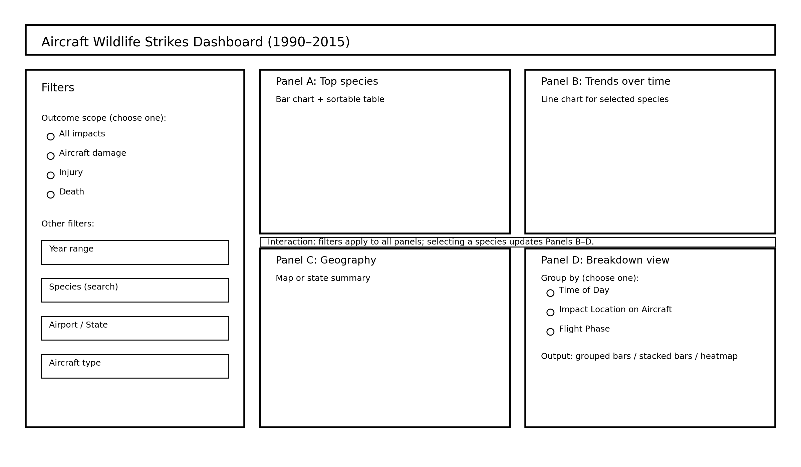

## Milestone 1 Required Files (This part must be updated each milestone!!!)
1. **Submission Instruction:** Since canvas-submission.md is no longer required, instead, we uploaded our dataset [here](Milestone%201/database.csv).
2. **Proposal:** [proposal.md](Milestone%201/proposal.md)
3. **Description of your app & sketch:** [README.md](README.md)
4. **Team work contract and collaborative documentation**:
   - [Team work contract](team-contract.md)
   - [Code of Conduct](CODE_OF_CONDUCT.md)
   - [Contribution guidelines](CONTRIBUTING.md)
5. **Start developing your app:** [master-plotter.ipynb](Milestone%201/master-plotter.ipynb)

## App description

This app explores the FAA Aircraft Wildlife Strikes dataset (1990–2015) to help users identify which bird species are associated with the most serious outcomes. Users start by choosing an outcome scope from four options: all impacts, impacts that caused aircraft damage, impacts that caused injury, or impacts that caused death. This makes it easy to compare “most frequent” species against species linked to more severe consequences. Users can then narrow the data using filters such as year range, species search, airport/state, and aircraft type.

The interface is organized into four coordinated panels. 
- Panel A ranks species for the selected outcome scope and filter settings using a bar chart and a small sortable table for exact values. Selecting a species updates the remaining panels. 
- Panel B shows a time trend by year for the selected species to reveal whether the chosen outcome is increasing or decreasing over the study period. 
- Panel C summarizes where incidents occur geographically (for example, a state-level map or summary). 
- Panel D provides a deeper breakdown using a “group by” control with three choices: time of day, impact location on the aircraft, or flight phase. The app groups the filtered data accordingly and displays a comparison plot (such as grouped/stacked bars or a heatmap), helping users understand when and how risk concentrates.

Overall, the design supports both ranking species and explaining the conditions associated with higher-risk outcomes while remaining realistic to implement.

### App sketch

